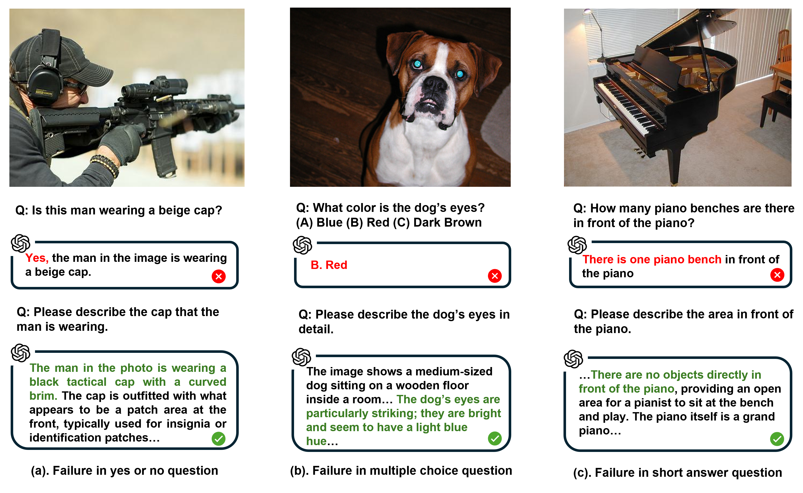

# Difficult Task Yes but Simple Task No: Unveiling the Laziness in Multimodal LLMs - (EMNLP 2024 Findings)

[Sihang (Nagi) Zhao](https://akutagawa1998.github.io/), [Youliang Yuan](https://youliangyuan.github.io/), [Xiaoying Tang](https://sse.cuhk.edu.cn/en/faculty/tangxiaoying), [Pinjia He](https://pinjiahe.github.io/)
               
### [Paper](our paper link) | [Project Page](our project page) | [LazyBench](our LazyBench)




## Contents:
1. [Getting Started](#start)
2. [Benchmark](#benchmarks)
3. [Evaluation](#evaluation)
4. [License](#license)
5. [Citation](#citation)
6. [Acknowledgement](#acknowledgement)

## Getting Started <a name="start"></a>


### LazyBench
OurLazyBench is available [here](our hf page) to measure **multimodal LLM's** laziness via VQA. 
The original version of LazyBench is separated into a folder containing 101 images, and an annotation CSV file with questions and correct answers. In our paper, the dataset we use contained 101 images.
The format of the data is:

```
├── lazy_images
│   ├── 1.jpg
│   ├── 2.jpg
│   ├── 3.jpg
│   ├── ...
│   └── 101.jpg
└── lazy_labels.csv
```
We are continually expanding this LazyBench. The latest version of lazy_labels can be found in the latest folder:
```
├── lazy_images_v1
│   ├── 1.jpg
│   ├── 2.jpg
│   ├── 3.jpg
│   ├── ...
│   └── 210.jpg
└── lazy_labels_v1.csv
```

## License <a name="license"></a>

This project is under the MIT license. See [LICENSE](LICENSE) for details.

## Citation <a name="citation"></a>
Please consider citing our paper if you find this project helpful for your research:
*Coming Soon*


## Acknowledgement <a name="acknowledgement"></a>
-  This work is built upon the [LLaVA](https://github.com/haotian-liu/LLaVA).
-  Many thanks to Xiaocui, the manti who came into my balcony and stayed with me during my experiments and paper writing.
